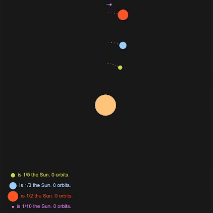

# :dizzy: Orbits
**Orbits simulation** using just **Newton's Law** with *p5.js* in *JavaScript* to illustrate orbital mechanics.

## Sample


## Code
*Newton's law of universal gravitation* is used to calculate a force **magnitude** between two bodies.
The **direction** of the force depends on the position of the bodies.
This two components result in a **acceleration vector** applied to the current **velocity** and then to the current **position**.
```javascript
calculateForce(body) {
  let G = 10; // Universal gravitational constant
  let r = this.position.dist(body.position); // Distance between bodies	
  let F = G * (this.mass * body.mass) / (r * r); // Newton's law of universal gravitation
  return F; // Resulting force
}

gravity(body) {
  let force = p5.Vector.sub(body.position, this.position); // Direction	
  force.setMag(this.calculateForce(body)); // Magnitude
  this.acceleration.add(force); // Apply acceleration
}

move() {
  this.velocity.add(this.acceleration); // Speed
  this.position.add(this.velocity); // Position	
}
```
